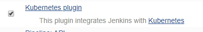

## k8s部署jenkins
### 部署jenkins
- 拉取代码
  ``` shell
  #git clone https://github.com/38699678/k8s-study.git
  ```
- 部署jenkins
  ``` shell
  #cd jenkins
  #kubectl apply -f .
### 配置Jenkins
- 查看jenkins的token
  ``` shell
  #查看jenkins的token
  #kubectl logs pod_name -n jenkins 
- 配置jenkins通过k8s环境自动生成slave  
  该功能是需要jenkins的kubernetes plugin插件支持，配置前先安装该插件
  
