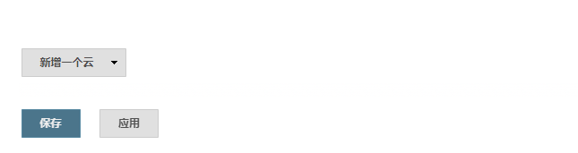
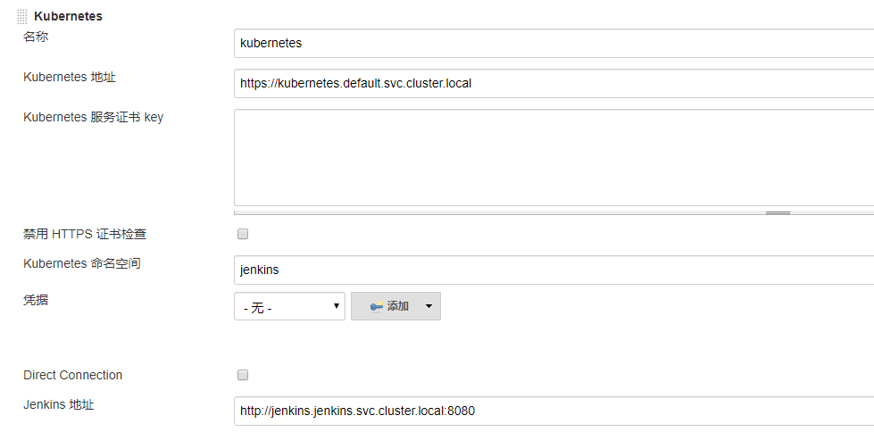

## k8s部署jenkins
### 部署jenkins
- 拉取代码
  ``` shell
  #git clone https://github.com/38699678/k8s-study.git
  ```
- 部署jenkins
  ``` shell
  #cd jenkins
  #kubectl apply -f .
### 配置Jenkins
- 查看jenkins的token
  ``` shell
  #查看jenkins的token
  #kubectl logs pod_name -n jenkins 
- 配置jenkins通过k8s环境自动生成slave  
  1. 该功能是需要jenkins的kubernetes plugin插件支持，配置前先安装该插件
  
  2. 系统管理-->系统配置→拉到页面最底下，新建一个云，选择kubernetes
  
  3. 配置kubernetes-plugin
  
  4. kubernetes地址：该地址为kubernetes的内部dns地址，因为我们jenkins是运行在该k8s环境中，所以可以直接用该域名调用。他的格式 服务名. 名称空间. svc.cluster.local  
  kubernetes的命名空间：此处是选择jenkins部署的名称空间  
  jenkins地址： 此处同kubernetes地址一样，都可以采用jenkins在k8s环境中的域名地址  
  
  
