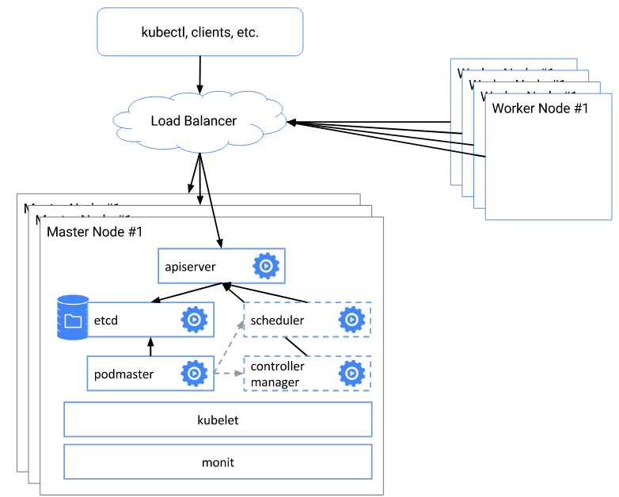

## kubernetes高可用集群部署  
一 前期准备  
- 架构图

   
 在架构中的所有节点运行以下这些操作。
 ``` shell
  #systemctl stop firewalld 
  #systemctl disable firewalld
  #setenforce 0
  #vi /etc/sysconfig/selinux
    SELINUX=disable
  #wget http://mirrors.aliyun.com/repo/epel-7.repo -O /etc/yum.repos.d/epel.repo
  #wget https://mirrors.aliyun.com/docker-ce/linux/centos/docker-ce.repo -O /etc/yum.repos.d/docker-ce.repo
  #cat >>/etc/yum.repos.d/kubernetes.repo <<EOF
[kubernetes]
name=Kubernetes
baseurl=https://mirrors.aliyun.com/kubernetes/yum/repos/kubernetes-el7-x86_64/
enabled=1
gpgcheck=1
repo_gpgcheck=1
gpgkey=https://mirrors.aliyun.com/kubernetes/yum/doc/yum-key.gpg https://mirrors.aliyun.com/kubernetes/yum/doc/rpm-package-key.gpg
EOF
  #yum install -y docker-ce kubelet kubeadm 
  #systemctl enable docker 
  #systemctl enable kubelet
  #systemctl start docker 
  #systemctl start kubelet
  #cat <<EOF > /etc/sysctl.d/k8s.conf
net.bridge.bridge-nf-call-ip6tables = 1
net.bridge.bridge-nf-call-iptables = 1
net.ipv4.ip_nonlocal_bind = 1
net.ipv4.ip_forward = 1
vm.swappiness=0
EOF
  #sysctl --system
  #cat > /etc/sysconfig/modules/ipvs.modules <<EOF
#!/bin/bash
modprobe -- ip_vs
modprobe -- ip_vs_rr
modprobe -- ip_vs_wrr
modprobe -- ip_vs_sh
modprobe -- nf_conntrack_ipv4
EOF
  #chmod 755 /etc/sysconfig/modules/ipvs.modules
  #bash /etc/sysconfig/modules/ipvs.modules && lsmod | grep -e ip_vs -e nf_conntrack_ipv4  
  ``` 
  二  配置前端反向代理和keepalived
  ``` shell
  #yum install keepalived nginx -y
  #vi /etc/keepalived
   ! Configuration File for keepalived

  global_defs {
    notification_email {
      acassen@firewall.loc
      failover@firewall.loc
      sysadmin@firewall.loc
    }
    notification_email_from Alexandre.Cassen@firewall.loc
    smtp_server 192.168.200.1
    smtp_connect_timeout 30
    router_id LVS_DEVEL
    vrrp_skip_check_adv_addr
    vrrp_strict
    vrrp_garp_interval 0
    vrrp_gna_interval 0
  }

  vrrp_instance VI_1 {
      state MASTER
      interface ens33
      preempt
      virtual_router_id 10
      priority 100
      advert_int 1
      authentication {
          auth_type PASS
          auth_pass 1111
      }
      virtual_ipaddress {
          192.168.120.12 dev ens33 label ens33:1
      }
  }

  #vi /etc/nginx/nginx.conf
  user nginx;
  worker_processes auto;
  error_log /var/log/nginx/error.log;
  pid /run/nginx.pid;

  # Load dynamic modules. See /usr/share/doc/nginx/README.dynamic.
  include /usr/share/nginx/modules/*.conf;

  #include /usr/lib64/nginx/modules/*.so;
  events {
  worker_connections 1024;
  }

  stream {
  log_format proxy '$remote_addr $remote_port - [$time_local] $status $protocol '
  '"$upstream_addr" "$upstream_bytes_sent" "$upstream_connect_time"' ;
  access_log /var/log/nginx/nginx-proxy.log proxy;
  upstream kubernetes_lb{
  server 192.168.120.3:6443 weight=5 max_fails=3 fail_timeout=30s;
  server 192.168.120.4:6443 weight=5 max_fails=3 fail_timeout=30s;
  }
  server {
  listen 7443;
  proxy_connect_timeout 30s;
  proxy_timeout 30s;
  proxy_pass kubernetes_lb;
  }
  }
  #systemctl enable nginx && systemctl start nginx  
  #systemctl enable keepalived && systemctl start keepalived

 ```
 三、节点初始化
 - 创建config文件
   ``` shell
   #kubeadm config print init-defaults > kubeadm-init.yaml
   #vi kubeadm-init.yml
    apiVersion: kubeadm.k8s.io/v1beta2
    bootstrapTokens:
    - groups:
      - system:bootstrappers:kubeadm:default-node-token
      token: abcdef.0123456789abcdef
      ttl: 24h0m0s
      usages:
      - signing
      - authentication
    kind: InitConfiguration
    localAPIEndpoint:
      advertiseAddress: 192.168.120.3 #当前节点地址
      bindPort: 6443 #当前master端口
    nodeRegistration:
      criSocket: /var/run/dockershim.sock
      name: master1
      taints:
      - effect: NoSchedule
        key: node-role.kubernetes.io/master
    ---
    apiServer:
      timeoutForControlPlane: 4m0s
    apiVersion: kubeadm.k8s.io/v1beta2
    certificatesDir: /etc/kubernetes/pki
    clusterName: kubernetes
    controllerManager: {}
    controlPlaneEndpoint: "192.168.120.10:7443" #前端代理地址
    dns:
      type: CoreDNS
    etcd:
      local:
        dataDir: /var/lib/etcd
    imageRepository: k8s.gcr.io
    kind: ClusterConfiguration
    kubernetesVersion: v1.17.0
    networking:
      podSubnet: "10.244.0.0/16" #k8s集群pod地址段
      dnsDomain: cluster.local
      serviceSubnet: 10.96.0.0/12 #k8s集群service地址段
    scheduler: {}
    ---
    apiVersion: kubeproxy.config.k8s.io/v1alpha1
    kind: KubeProxyConfiguration
    mode: "ipvs"
    ```
- 初始化master节点
  ``` shell 
  # kubeadm init --config kubeadm-init.yaml --upload-certs
  #--upload-certs 上传 control-plane 证书到 kubeadm-certs Secret.
  Your Kubernetes control-plane has initialized successfully!

  To start using your cluster, you need to run the following as a regular user:

    mkdir -p $HOME/.kube
    sudo cp -i /etc/kubernetes/admin.conf $HOME/.kube/config
    sudo chown $(id -u):$(id -g) $HOME/.kube/config

  You should now deploy a pod network to the cluster.
  Run "kubectl apply -f [podnetwork].yaml" with one of the options listed at:
    https://kubernetes.io/docs/concepts/cluster-administration/addons/

  You can now join any number of the control-plane node running the following command on each as root:

    kubeadm join 192.168.120.10:7443 --token abcdef.0123456789abcdef \
      --discovery-token-ca-cert-hash sha256:bf8938b8164d3cc7bcfd782ab539643a1b9a1b2c9b9902692739db21ffdff881 \
      --control-plane --certificate-key cf744c111a0782a79b387ed7fb598dad9e08fd3cae154e02926a6269ce3d960a

  Please note that the certificate-key gives access to cluster sensitive data, keep it secret!
  As a safeguard, uploaded-certs will be deleted in two hours; If necessary, you can use
  "kubeadm init phase upload-certs --upload-certs" to reload certs afterward.

  Then you can join any number of worker nodes by running the following on each as root:

  kubeadm join 192.168.120.10:7443 --token abcdef.0123456789abcdef \
      --discovery-token-ca-cert-hash sha256:bf8938b8164d3cc7bcfd782ab539643a1b9a1b2c9b9902692739db21ffdff881 
  be
    
  #mkdir -p $HOME/.kube
  #sudo cp -i /etc/kubernetes/admin.conf $HOME/.kube/config
  #sudo chown $(id -u):$(id -g) $HOME/.kube/config
  ```
- 去其他master节点初始化
  ``` shell
  #kubeadm join 192.168.120.10:7443 --token abcdef.0123456789abcdef \
      --discovery-token-ca-cert-hash sha256:bf8938b8164d3cc7bcfd782ab539643a1b9a1b2c9b9902692739db21ffdff881 \
      --control-plane --certificate-key cf744c111a0782a79b387ed7fb598dad9e08fd3cae154e02926a6269ce3d960a
  ```
- 去node节点初始化
  ``` shell
  #kubeadm join 192.168.120.10:7443 --token abcdef.0123456789abcdef \
      --discovery-token-ca-cert-hash sha256:bf8938b8164d3cc7bcfd782ab539643a1b9a1b2c9b9902692739db21ffdff881 
  be
