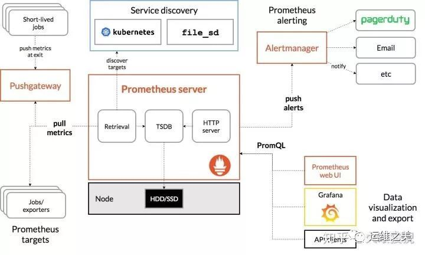

# helm部署prometheus-operator  
### 一、promethues基础知识  
该文采用prometheus operator以及helm工具在kubernetes集群上部署。
关于什么是 Prometheus Operator 以及为什么要用 Prometheus Operator？
``` text
Operator 是以软件的方式定义运维过程，是一系列打包、部署和管理 Kubernetes 应用的方法。简单  来说就是将运维过程中的手动操作转换为自动化流程，通过 Kubernetes 的 CRD（Custom   Resource Definition）将部署前后的相关操作自动化，同时以参数的方式提供了灵活性。而   Prometheus Operator 是 CoreOS 提供的一整套 Prometheus 的 Operator，方便了 Prometheus 的部署。  
```
- Prometheus架构图  
 
- Prometheus Server  
  Prometheus Server 是监控系统的服务端，服务端通过服务发现的方式，抓取被监控服务的指标，或者通过 pushgateway 的间接抓取，抓取到指标数据后，通过特定的存储引擎进行存储，同时暴露一个 HTTP 服务，提供用 PromQL 来进行数据查询。注意，Prometheus 是定时采样数据，而不是全量数据。 
- Exporter  
  Prometheus 需要服务暴露 http 接口，如果服务本身没有，我们不需要改造服务，可以通过 exporter 来间接获取。Exporter 就充当了 Prometheus 采集的目标，而由各个 exporter 去直接获取指标。目前大多数的服务都有现成的 exporter，我们不需要重复造轮子，拿来用即可，如 MySQL，MongoDB 等，可以参考这里。
- Push Gateway
  Prometheus 采集指标的方式主要有两种，一种是服务端暴露接口（Exporter），由 Prometheus 主动去抓取指标，称为 pull 模式。另一种是服务端主动上报，服务端将指标主动上报至 Push Gateway，Prometheus 再从 Push Gateway 中获取，称为 push 模式。而 Push Gateway 就是 push 模式中重要的中介角色，用于暂存服务端上报的指标，等待 Prometheus 收集。

  为什么要有两种模式呢？我们来比较一下这两种模式的特点。

  Pull 模式：Prometheus 主动抓取的方式，可以由 Prometheus 服务端控制抓取的频率，简单清晰，控制权在 Prometheus 服务端。通过服务发现机制，可以自动接入新服务，去掉下线的服务，无需任何人工干预。对于各种常见的服务，官方或社区有大量 Exporter 来提供指标采集接口，基本无需开发。是官方推荐的方式。

  Push 模式：由服务端主动上报至 Push Gateway，采集最小粒度由服务端决定，等于 Push Gateway 充当了中介的角色，收集各个服务主动上报的指标，然后再由 Prometheus 来采集。但是这样就存在了 Push Gateway 这个性能单点，而且 Push Gateway 也要处理持久化问题，不然宕机也会丢失部分数据。同时需要服务端提供主动上报的功能，可能涉及一些开发改动。不是首选的方式，但是在一些场景下很适用。例如，一些临时性的任务，存在时间可能非常短，如果采用 Pull 模式，可能抓取不到数据。
- Alert Manager
  Alert Manager 是 Prometheus 的报警组件，当 Prometheus 服务端发现报警时，推送 alert 到 Alert Manager，再由 Alert Manager 发送到通知端，如 Email，Slack，微信，钉钉等。Alert Manager 根据相关规则提供了报警的分组、聚合、抑制、沉默等功能。
- Grafana
  Prometheus 提供了一个简单的 web UI 界面，用于查询数据，查看告警、配置等，官方推荐使用另一个开源项目 grafana 来做指标的可视化展示，制作仪表盘等。
### 二、在kubernetes中部署prometheus
- 拉取prometheus-operator
  ``` bash
  #helm pull stable/prometheus-operator
  #tar -zxvf prometheus-operator-8.3.3.tgz
  #cd prometheus-operator 
  ``` 
- 根据需求修改配置文件
  ``` yaml
  #vi values.yml
  #修改altermanager的服务，改成nodePort类型
    service:
    annotations: {}
    labels: {}
    clusterIP: ""

    ## Port for Alertmanager Service to listen on
    ##
    port: 9093 
    ## Port to expose on each node
    ## Only used if service.type is 'NodePort'
    ##
    nodePort: 30903
    ## List of IP addresses at which the Prometheus server service is available
    ## Ref: https://kubernetes.io/docs/user-guide/services/#external-ips
    ##
    externalIPs: []
    loadBalancerIP: ""
    loadBalancerSourceRanges: []
    ## Service type
    ##
    type: NodePort
  #修改prometheus的服务，添加nondePort和修改类型为nodePort
    service:
    annotations: {}
    labels: {}
    clusterIP: ""

    ## Port for Prometheus Service to listen on
    ##
    port: 9090

    ## To be used with a proxy extraContainer port
    targetPort: 9090

    ## List of IP addresses at which the Prometheus server service is available
    ## Ref: https://kubernetes.io/docs/user-guide/services/#external-ips
    ##
    externalIPs: []

    ## Port to expose on each node
    ## Only used if service.type is 'NodePort'
    ##
    nodePort: 30090

    ## Loadbalancer IP
    ## Only use if service.type is "loadbalancer"
    loadBalancerIP: ""
    loadBalancerSourceRanges: []
    ## Service type
    ##
    type: NodePort

    sessionAffinity: ""
  ```
  ``` yaml
  #vi charts/grafana/values.yaml
  #修改nodeport类型，并添加grafana的暴露端口
  service:
  type: NodePort
  port: 80
  targetPort: 3000
  nodePort: 30030
    # targetPort: 4181 To be used with a proxy extraContainer
  annotations: {}
  labels: {}
  portName: service
  ```
- 持久化数据
  ``` yaml
  #创建pv，持久化prometheus的数据
  #vi pvc.yaml
  apiVersion: v1
  kind: PersistentVolumeClaim
  metadata:
    name: influxdb-pvc
    namespace: monitoring
    labels:
      app: influxdb
      release: influxdb
  spec:
    accessModes:
    - ReadWriteOnce
    storageClassName: monitor-ebs  # 选择合适的存储类，这里需要提前创建一个存储类
    resources:
      requests:
        storage: 200Gi  # 设置合适的存储空间
  ```
- 创建influxdb.yml
  ``` yaml
  # 持久化存储配置
  persistence:
    enabled: true
    useExisting: true
    name: "influxdb-pvc"  # 使用我们刚才创建的 PVC
    accessMode: "ReadWriteOnce"
    size: 200Gi

  # 创建 Prometheus 的数据库
  env:
    - name: INFLUXDB_DB
      value: "prometheus"

  # influxdb 配置
  config:
    data:
      # 这两个配置默认限制了数据的上限，建议设置为 0 变成无限制，不然在达到上限后插入数据会返回错误
      max_series_per_database: 0
      max_values_per_tag: 0
    http:
      enabled: true  # 启动 http
  initScripts:
    enabled: true
    scripts:
      # 设置数据保留策略，默认是永不失效，需要人工清理
      # 保留 180 天数据
      retention.iql: |+
        CREATE RETENTION POLICY "default_retention_policy" on "prometheus" DURATION 180d REPLICATION 1 DEFAULT
  ```
  max-series-per-database  
  内存中每个数据库最大的序列数量，默认是 1000000，设置为 0 改成无限制。如果新来的数据增加了序列数量并超过了这个上限，那么数据就会被丢弃就并返回一个 500 错误：
  ``` text
  {"error":"max series per database exceeded: <series>"}
  ```
  max-values-per-tag  
  内存中每个标签的最大数据量，默认是 100000，设置为 0 改成无限制。如果新来的数据超过了这个限制，也会被丢弃并返回写入失败的错误。
  ``` bash
  #helm install --name=influxdb --namespace=monitoring -f influxdb.yaml stable/influxdb

- 部署crds
  ``` yaml
  #kubectl apply -f crds/
  ```
- 部署prometheus-operator
  ``` yaml
  #helm install --name=prometheus --namespace=monitoring  ./ --set prometheusOperator.createCustomResource=false
  [root@master1 prometheus-operator]# kubectl get pods -n monitoring
  NAME                                                     READY   STATUS    RESTARTS   AGE
  alertmanager-prometheus-prometheus-oper-alertmanager-0   2/2     Running   0          4h5m
  prometheus-grafana-577fcb45f4-wmsg6                      2/2     Running   0          4h5m
  prometheus-kube-state-metrics-67b765f8b8-dt4b7           1/1     Running   0          4h5m
  prometheus-prometheus-node-exporter-flphx                1/1     Running   0          4h5m
  prometheus-prometheus-node-exporter-m5gjv                1/1     Running   0          4h5m
  prometheus-prometheus-node-exporter-s9xf2                1/1     Running   0          4h5m
  prometheus-prometheus-node-exporter-zsnbm                1/1     Running   0          4h5m
  prometheus-prometheus-oper-operator-6c4d98f8df-8pwcm     2/2     Running   0          4h5m
  prometheus-prometheus-prometheus-oper-prometheus-0       3/3     Running   1          4h5m
  ```
 #查看service暴露端口
  ``` yaml
  [root@master1 prometheus-operator]# kubectl get svc -n monitoring
  NAME                                      TYPE        CLUSTER-IP      EXTERNAL-IP   PORT(S)                      AGE
  alertmanager-operated                     ClusterIP   None            <none>        9093/TCP,9094/TCP,9094/UDP   4h7m
  prometheus-grafana                        NodePort    10.96.174.253   <none>        80:30030/TCP                 4h7m
  prometheus-kube-state-metrics             ClusterIP   10.96.246.166   <none>        8080/TCP                     4h7m
  prometheus-operated                       ClusterIP   None            <none>        9090/TCP                     4h7m
  prometheus-prometheus-node-exporter       ClusterIP   10.96.95.92     <none>        9100/TCP                     4h7m
  prometheus-prometheus-oper-alertmanager   NodePort    10.96.44.37     <none>        9093:30903/TCP               4h7m
  prometheus-prometheus-oper-operator       ClusterIP   10.96.188.253   <none>        8080/TCP,443/TCP             4h7m
  prometheus-prometheus-oper-prometheus     NodePort    10.96.96.240    <none>        9090:30090/TCP               4h7m
  ```
现在prometheus+grafana+altermanager就部署成功了

- 填坑
  刚装好后，kube-proxy和etcd无法获取数据
  1. kube-proxy
  ``` yaml
  #kubectl -n kube-system edit cm kube-proxy
  metricsBindAddress: "0.0.0.0:10249"
  ```
  2. etcd
  ``` yaml
  # vi /etc/kubernetes/manifests/etcd.yaml 
  - --listen-metrics-urls=http://0.0.0.0:2381
  ``` 
  
